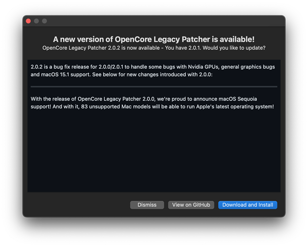
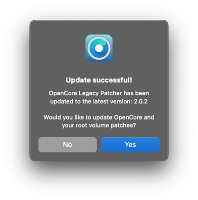
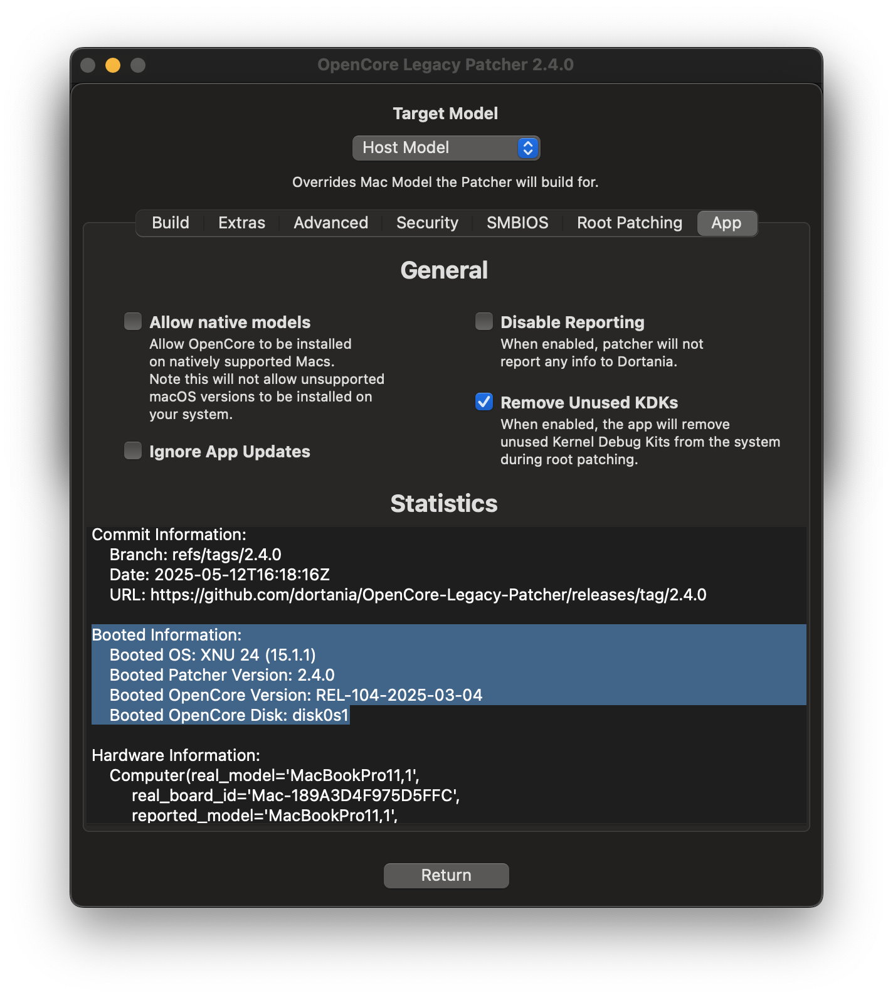
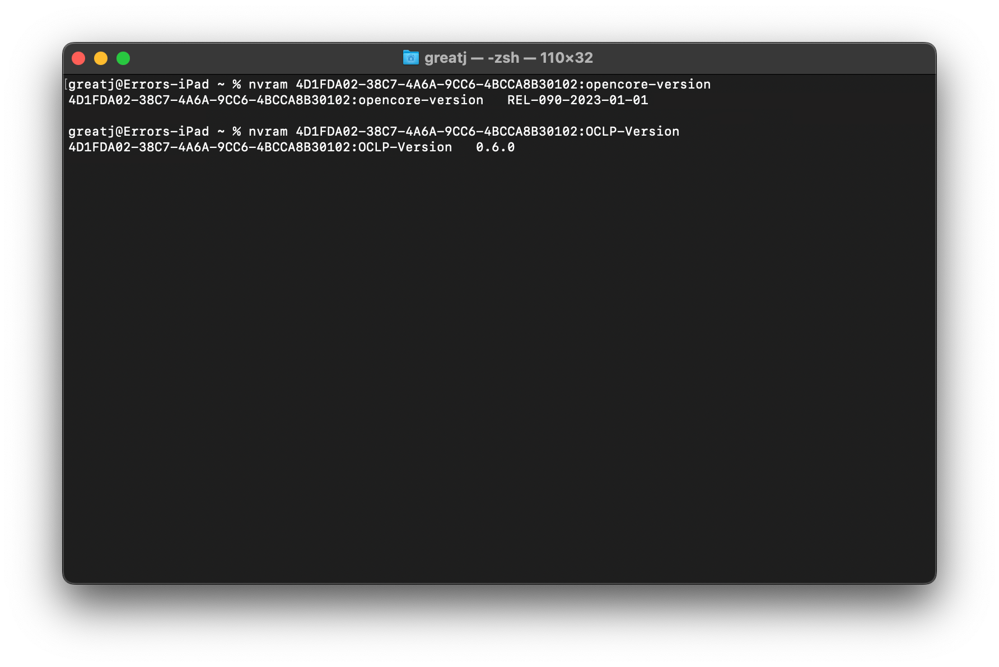
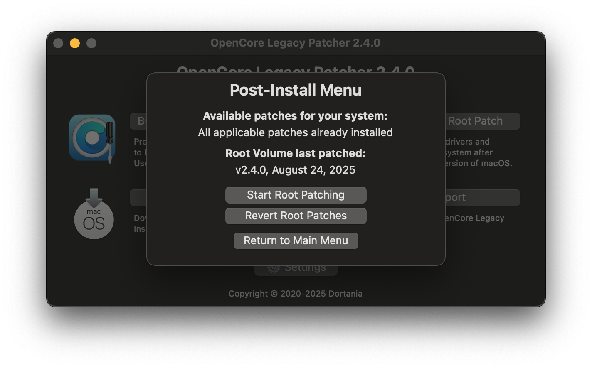

# Updating

This guide explains how to get fully up to date application, bootloader and patches.

## Updating the application, OpenCore and patches

When you open the app, it checks for a newer version. If an update is detected, the app downloads and installs it automatically, no confirmation needed.

* If you'd rather confirm updates yourself, enable `Turn Off Auto Updates` in `Settings -> Advanced`. The app still checks for updates when opened, but shows the new version with its changelog and asks before installing it.
* You can also check for updates at any time with the `Check for updates` button.
* Automatic updates are disabled when running the app from source or on special builds.

[You can also manually download the latest release here.](https://github.com/albert-mueller/OpenCore-Legacy-Patcher-T2/releases)

After the update, the application asks if you want to update OpenCore and root patches. 

* If you do not need to change any settings, click "Yes" on the patch update question and follow the procedure to update OpenCore and root patches automatically.
   * If you do want to change settings, select "No" and do your settings.
   * In case you selected "No", you will have to manually build and install OpenCore and then manually install new root patches to ensure you're running on the latest OpenCore with your settings and the fixes for on-disk patches. 


| Update available (with auto updates turned off) | App update success, patch update question |
| :--- | :--- |
|  |  | 


#### Checking OCLP and OpenCore versions

To check what version of OpenCore bootloader and the Patcher you're currently running, open the OCLP application and navigate to `Settings -> App` and look for "Booted Information". Alternatively you can check the version from Terminal using the following commands.

Check the status and version of root patches from `Post Install Volume Patch` section in the main menu.

```bash
# OpenCore Version
nvram 4D1FDA02-38C7-4A6A-9CC6-4BCCA8B30102:opencore-version
# Patcher Version
nvram 4D1FDA02-38C7-4A6A-9CC6-4BCCA8B30102:OCLP-Version
```


| Version in app | Version in Terminal |  Root patch version |
| :--- | :--- | :--- |
|  |  |  |


## Preparing OCLP for macOS update

It is usually recommended to be on the latest OCLP version for macOS updates. This part details how to prepare OCLP for latest update.

### Major upgrades 

This part is for major upgrades, such as `Sonoma (14)` -> `Sequoia (15)`

1. Make sure the OCLP app is up to date. 
2. After app has updated, rebuild OpenCore to the internal disk to update the bootloader. 
   * You can also update root patches but this part is optional in this stage, as they will be wiped by the update.
2. Download the macOS version you want and create an installer USB drive using OCLP as detailed in the original [Creating macOS Installers](INSTALLER.md) guide, then follow the [Booting OpenCore and macOS](BOOT.md) guide boot to into the installer on your USB drive.
3. Start macOS installation and follow the process, do not use Disk Utility if you don't want to wipe your disk.
4. After installation, reinstall [root patches](POST-INSTALL.md#applying-post-install-volume-patches).

**Note:** Major upgrades may work using System Settings but this is not recommended.

### Minor updates

This part is for minor updates, which are also called the "dot updates". Such as `12.x`, `13.x` etc.

1. Make sure the OCLP app is up to date. 
2. Rebuild OpenCore to the internal disk to update the bootloader. 
   * You can also update root patches but this part is optional in this stage, as they will be wiped by the update.
3. Start update from System Settings.
    * If your system requires [KDKSupportPkg](POST-INSTALL.md#kdk-kernel-debug-kit), OCLP will start downloading it automatically as long as you are connected to the internet and have the [background process](PROCESS.md) enabled.
4. Once installed, go into OCLP app and reinstall [root patches](POST-INSTALL.md#applying-post-install-volume-patches).

::: warning Important

Some systems on Sequoia require [MetallibSupportPkg](POST-INSTALL.md#metallibsupportpkg) during root patching after an update, which requires internet connection to download. If OCLP doesn't see internet connection, it will first offer a patch for WiFi only. You will have to reboot, connect to the internet and rerun root patching for the rest of the patches.

:::


